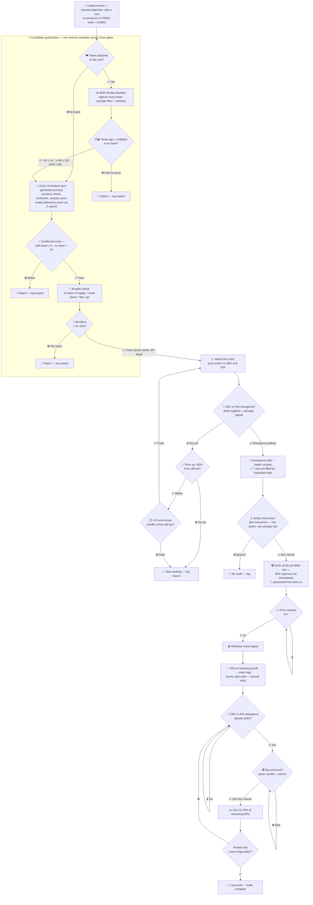
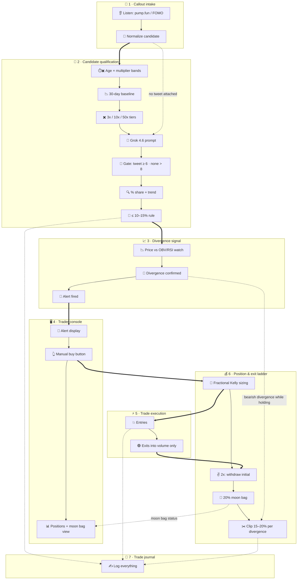

# Memecoin virality trader — P-stack pass
Status: open
Updated: 2026-09-06
Emoji: 🪙
System: greenfield
Recommended: 7 departments, 10 sections, 8 genuine modules

Same trading idea as issue #4, re-sliced through the P-stack lens: one shared Candidate record carries a coin through all three qualification gates (virality, narrative, bundler) instead of three phase-named departments, and every capability is named for the domain object it owns, not the technical layer it runs in. Trigger: a callout arrives. Outcome: a closed, logged trade with the initial capital secured at 2x and a manual-only moon bag left running.

## Operating flow


## This idea needs
1. Callout intake (pump.fun / FOMO sources)
2. Candidate qualification (virality gate + Grok narrative gate + bundler gate, one shared record)
3. Divergence signal (OBV/RSI divergence + staleness guards + alert)
4. Trader console (divergence alert + manual buy button)
5. Trade execution (Solana + Robinhood Chain, sell-into-volume)
6. Position & exit ladder (fractional Kelly sizing, 2x rule, moon bag, clip ladder)
7. Trade journal (every gate + fill logged)

## Departments

### Callout Intake
Readiness: ready-mocks
Icon: 📣
Responsibility: Detect and normalize every callout from the tracked traders/devs into one candidate shape the pipeline can score.
Starts when: the tracked-source list is configured (owner-supplied)
Completes when: a normalized candidate (coin address, attached tweet, callout timestamp, source) streams in real time
Boundary: owns source adapters and normalization; does not own qualification or trading
Owns: callout tracking, pump.fun / FOMO sources, web + mobile ingestion
Inputs: tracked-source list (owner), callout streams (external)
Outputs: normalized candidate → Candidate Qualification
Needs from: nothing
Steps:
1. Configure the tracked traders/devs list (which callers count — owner input)
2. Listen on pump.fun and FOMO channels (web + mobile sources)
3. Normalize each callout: coin address, attached tweet, timestamp, source
4. Emit the candidate to Candidate Qualification

### Candidate Qualification
Readiness: ready-mocks
Icon: 🎯
Responsibility: Run one shared candidate record through all three qualification gates — viral enough for its age, a real narrative with a high enough Grok score, and clean holders — until it's clean or rejected.
Starts when: a normalized candidate arrives from Callout Intake (with or without an attached tweet)
Completes when: the candidate clears all three gates or is rejected at whichever gate stops it, with the reason logged
Boundary: owns the candidate's scoring state (virality multiplier, narrative score, bundler %/trend) and all three gate thresholds; does not own callout normalization or chart/signal work
Owns: 30-day tweet baseline, virality multiplier + age-band tiers (<1h ≥3x · 1–6h ≥10x · ≥24h ≥50x), Grok 4.6 prompt + five extracted scores + dual gate (≥6 with tweet · >8 without), bundler % share + trend (down/flat/up) + ≤10–15% strict rule
Inputs: normalized candidate (Callout Intake), tweet metrics (X API — external), Grok 4.6 API (xAI — external, owner account), bundler data (chain analytics — external)
Outputs: clean candidate (with call-out time + price) → Divergence Signal; rejected candidate + reason → Trade Journal
Needs from: Callout Intake
Steps:
1. Tweet attached? Build the 30-day baseline (average likes + retweets) and gate by age-band multiplier: under 1 hour needs ≥3x, 1–6 hours needs ≥10x, 24 hours or more needs ≥50x — these three tiers are the complete rule, anything outside them (including 6–24h) rejects and logs. No-tweet candidates skip straight to the next gate.
2. Feed the candidate into Grok 4.6 (grok-4.6, xAI API) with the pre-generated prompt; extract narrative, thesis, sentiment, veracity score, and virality (attention) score via X search; combine into one score; gate: ≥6 with a tweet, >8 without (a tweet's virality earns the coin slack on the score)
3. Pull the bundler share — wallets that bought in the creation block, reading the full block and excluding program-owned accounts (the bonding curve); classify the trend as decreasing, stagnating, or increasing; gate: reject anything over 10–15% bundlers (below 10% preferred), especially if increasing
4. Any gate failure rejects and logs the reason immediately — the candidate never proceeds past the gate that stopped it

### Divergence Signal
Readiness: contract
Icon: 📈
Responsibility: Watch a clean candidate's chart while it's fresh, and when price and oscillators disagree, raise the alert. It never spends money — Bobby clicks buy.
Starts when: the clean-candidate contract is frozen
Completes when: a divergence alert reaches Bobby in time for him to act, or the coin is dropped as stale
Boundary: owns divergence detection, the staleness guards, and the alert; does not own the buy decision, execution, or pattern detection (parked)
Owns: OBV divergence, RSI divergence, 30% distance guard, 15-candle freshness window, divergence alert
Inputs: clean candidate (Candidate Qualification), chart data OHLC + OBV/RSI (chart provider — external)
Outputs: divergence alert → Trader Console; bearish divergences while holding → Position & Exit Ladder
Needs from: Candidate Qualification
Steps:
1. Pin the contract with Candidate Qualification: clean-candidate payload (must include call-out time and call-out price)
2. Track price against OBV (on-balance volume = running total of volume direction) and RSI (relative strength index = momentum gauge)
3. Staleness guards while watching — distance: stop tracking if price rises more than 30% from the call-out; time: stop tracking once 15 one-minute candles have passed since the call-out (the two can combine); either way, drop and log
4. Entry signal: a divergence on either oscillator — price makes a new high/low and the oscillator doesn't follow; both diverging together is the stronger version but either one qualifies
5. Fire the divergence alert to the Trader Console — never an automatic entry
6. While holding: keep flagging bearish divergences for the Position & Exit Ladder's clip strategy

### Trader Console
Readiness: waiting-internal
Icon: 🖥️
Responsibility: Bobby's console — shows the divergence alert and turns his decision into the buy command. The single manual gate in an otherwise automated system.
Starts when: Divergence Signal is emitting alerts and Trade Execution can receive commands
Completes when: Bobby sees a divergence alert and one tap turns it into an executed entry
Boundary: owns display and Bobby's manual actions only; never decides anything and never touches the chain directly
Owns: divergence alert display, Kelly pre-filled size display, manual buy button, positions + moon bag view
Inputs: divergence alerts (Divergence Signal), positions + moon bag read model (Position & Exit Ladder)
Outputs: manual buy click → Position & Exit Ladder (sizes it before anything executes)
Needs from: Divergence Signal, Trade Execution
Steps:
1. Pin the contract: alert payload (coin, scores, divergence type, freshness) and buy-command shape
2. Show the divergence alert clearly enough to decide in seconds: coin, which oscillator diverged, how fresh it is — and the fractional Kelly size already filled in
3. One obvious BUY button — one click executes exactly the pre-filled size; no typing, no sizing decisions at the button
4. Show open positions and the moon bag status from the position feed (the moon bag's manual home — see Unresolved)

### Trade Execution
Readiness: waiting-owner
Icon: ⚡
Responsibility: The only department that moves money — enters on Bobby's click and only his click, exits into buy pressure. Multi-venue: Solana (memecoins) and the Robinhood Chain (Robinhood's Arbitrum-based EVM L2, mainnet live — tokenized stocks, perps, crypto) [#8][#9].
Starts when: Bobby supplies the Solana wallet + keys and the Robinhood Chain EVM wallet keys (owner dependencies) and the buy-command contract is frozen
Completes when: a manual buy executes with the 30% stop attached and exits fill correctly on devnet, including the sell-into-volume rule
Boundary: owns transaction construction and fills; does not own when or why to trade
Owns: entries (manual-triggered only), exits, venue routing (Solana vs Robinhood Chain), sell-into-volume filter (green candle + volume only), fill reporting
Inputs: sized entry order (Position & Exit Ladder), clip orders (Position & Exit Ladder), Solana wallet keys + Robinhood Chain wallet keys (owner)
Outputs: fills → Position & Exit Ladder, Trade Journal
Needs from: Position & Exit Ladder
Steps:
1. Receive the Solana wallet + keys and the Robinhood Chain EVM wallet keys from Bobby (referenced by secret name, never stored raw); route each order to the chain that lists the coin
2. Execute the entry when the sized order arrives from Position & Exit Ladder — sized by fractional Kelly after Bobby's click; the alert alone never spends money
3. Set the 30% stop-loss immediately on entry — the automation starts at this exact moment
4. Execute exits only into buy pressure: green candles and real volume, never into red
5. Report every fill with price, size, and timestamp

### Position & Exit Ladder
Readiness: contract
Icon: 💰
Responsibility: Pre-fill every entry's size with fractional Kelly at alert time, then run the automated exit ladder from Bobby's manual entry to flat — 2x rule, moon bag, and the clip strategy. One capability because sizing and the ladder share position state.
Starts when: a divergence alert fires (sizing pre-fill); automation runs from Bobby's click
Completes when: the position (moon bag aside) is flat and the result is logged
Boundary: owns sizing and the ladder state; does not own signal detection or transaction building. **The Grok score never touches size** — Grok decides *whether* we trade, Kelly decides *how much*
Owns: fractional Kelly pre-filled sizing, 2x initial-capital recovery, 20% moon bag rule, 15–20% divergence clips, position state
Inputs: manual buy click (Trader Console), fills (Trade Execution), bearish divergences (Divergence Signal), live price + volume (chart provider — shared foundation), Kelly inputs (owner: bankroll, win-rate + payoff estimates, chosen fraction)
Outputs: sized entry order + clip orders → Trade Execution; results → Trade Journal; moon bag → Trader Console (manual)
Needs from: Trader Console, Trade Execution
Steps:
1. Pin the contracts: buy-click shape, sized entry order, fill events, clip orders
2. When the alert fires: pre-compute the fractional Kelly size and attach it to the alert so the console shows it pre-filled — Bobby never picks a number, and the Grok score is never an input to it
3. On Bobby's click: send the entry order at exactly the pre-filled size to Trade Execution
4. At 2x: withdraw the initial capital — from here it is house money
5. Set aside 20% of the remaining profit as the moon bag (never auto-sold; manual at Bobby's discretion)
6. On each OBV/RSI divergence (ideally both): order a clip of 15–20% of the remaining 80%, routed through Trade Execution's sell-into-volume filter
7. Repeat until flat; log the result and hand the moon bag to Bobby

### Trade Journal
Readiness: ready-mocks
Icon: 📓
Responsibility: One queryable record of everything — every gate decision, score, watch event, signal, and fill.
Starts when: the log schema contract is pinned
Completes when: any coin or trade can be replayed end to end from the log
Boundary: owns the log schema and storage; does not own the events themselves
Owns: gate decisions, scores, watch events, signals, fills, per-coin and per-trade queries
Inputs: events from every department (shared foundation)
Outputs: replayable history → Bobby, debugging, future backtesting
Needs from: nothing — every department writes to it
Steps:
1. Pin the log schema contract (event types and fields) that every department writes against
2. Record gate accept/reject reasons, watch events, entry/exit signals, and every fill
3. Make the log queryable per coin and per trade

## Correlated parallel groups
- Group: Trigger & execution | Members: Divergence Signal + Trader Console + Trade Execution | Snap: 4 | Mode: frozen-contract | Contract: alert payload + buy-command shape + idempotency | Risk: alert latency — a slow manual buy enters a stale divergence (see Unresolved: alert expiry)
- Group: Exit management | Members: Trade Execution + Position & Exit Ladder | Snap: 5 | Mode: frozen-contract | Contract: fill-event schema | Risk: a missed fill corrupts the ladder state (moon bag vs clip split goes wrong)

## Dependency matrix
- Bobby → Callout Intake | Supplies: tracked-source list (which traders/devs) | Type: owner | Blocking: yes | Mockable: yes
- Bobby → Trade Execution | Supplies: Solana wallet + keys (secret reference) | Type: owner | Blocking: yes | Mockable: yes
- Bobby → Trade Execution | Supplies: Robinhood Chain EVM wallet + keys (secret reference) | Type: owner | Blocking: yes | Mockable: yes
- Bobby → Candidate Qualification | Supplies: xAI API account (grok-4.6) | Type: owner | Blocking: yes | Mockable: yes
- Bobby → Candidate Qualification | Supplies: X API access + multiplier tier values (3x / 10x / 50x) | Type: owner | Blocking: yes | Mockable: no
- pump.fun / FOMO → Callout Intake | Supplies: callout stream | Type: external | Blocking: yes | Mockable: yes
- X API → Candidate Qualification | Supplies: 30-day tweet metrics | Type: external | Blocking: yes | Mockable: yes
- xAI API → Candidate Qualification | Supplies: narrative + scores | Type: external | Blocking: yes | Mockable: yes
- Chain analytics → Candidate Qualification | Supplies: bundler % + trend | Type: external | Blocking: yes | Mockable: yes
- Chart provider → Divergence Signal | Supplies: OHLC + OBV/RSI | Type: external | Blocking: yes | Mockable: yes
- Chart provider → Position & Exit Ladder | Supplies: live price + volume + divergences | Type: shared-foundation | Blocking: yes | Mockable: yes
- Callout Intake → Candidate Qualification | Supplies: normalized candidate | Type: soft-internal | Blocking: no | Mockable: yes
- Candidate Qualification → Divergence Signal | Supplies: clean candidate (with call-out time + price) | Type: soft-internal | Blocking: no | Mockable: yes
- Divergence Signal → Trader Console | Supplies: divergence alert payload | Type: soft-internal | Blocking: no | Mockable: yes
- Bobby → Trader Console | Supplies: the manual buy decision (the human gate) | Type: owner | Blocking: yes | Mockable: no
- Bobby → Position & Exit Ladder | Supplies: Kelly inputs — bankroll figure, win-rate + payoff estimates, chosen fraction | Type: owner | Blocking: yes | Mockable: yes
- Trader Console → Position & Exit Ladder | Supplies: manual buy click | Type: soft-internal | Blocking: no | Mockable: yes
- Position & Exit Ladder → Trade Execution | Supplies: sized entry order (fractional Kelly) + clip orders | Type: soft-internal | Blocking: no | Mockable: yes
- Position & Exit Ladder → Trader Console | Supplies: positions + moon bag read model | Type: soft-internal | Blocking: no | Mockable: yes
- Trade Execution → Position & Exit Ladder | Supplies: fills | Type: soft-internal | Blocking: no | Mockable: yes
- Divergence Signal → Position & Exit Ladder | Supplies: bearish divergences while holding | Type: soft-internal | Blocking: no | Mockable: yes
- All departments → Trade Journal | Supplies: events | Type: shared-foundation | Blocking: no | Mockable: yes

## Snap ranking
1. Trade Execution → Position & Exit Ladder — Snap 5 — fills feed the ladder directly through one event schema — freeze the fill-event contract first
2. Position & Exit Ladder → Trade Execution — Snap 5 — sized entry order and clip orders share the same channel schema — freeze the executor contract once
3. Divergence Signal → Trader Console — Snap 4 — one alert payload — freeze the alert schema
4. Trader Console → Position & Exit Ladder — Snap 4 — one buy-click payload — pin the command shape + idempotency rule
5. Callout Intake → Candidate Qualification — Snap 3 — needs the normalized coin+tweet shape — define the normalizer output
6. Candidate Qualification → Divergence Signal — Snap 3 — clean candidate with all three gate verdicts attached — freeze the candidate schema once, not three times
7. Chart provider → Divergence Signal + Position & Exit Ladder — Snap 3 — two consumers of one provider — pick the provider early; it is a shared foundation

## Parallel readiness
- Can start in parallel now: Callout Intake, Candidate Qualification, Trade Journal (all with mocks)
- Can start in parallel after contract definition: Divergence Signal, Position & Exit Ladder
- Must perform joint design first: —
- Must wait for another department: Trader Console (waits on Divergence Signal + Trade Execution)
- Blocked by external or owner dependency: Trade Execution (waits on Bobby's Solana wallet + keys and Robinhood Chain wallet keys)

## Structure tree
```
MEMECOIN VIRALITY TRADER
├── CALLOUT INTAKE
│   └── Source adapters (section)
│       ├── callout listener (module: external-adapter)
│       └── candidate normalizer (feature)
├── CANDIDATE QUALIFICATION
│   ├── Baseline engine (section)
│   │   ├── 30-day baseline calculator (module: project-specific)
│   │   ├── age × multiplier band check (feature)
│   │   └── multiplier tiers (configuration value)
│   ├── Grok scoring (section)
│   │   ├── Grok adapter (module: external-adapter)
│   │   └── score combiner (feature)
│   └── Holder verification (section)
│       ├── bundler data adapter (module: external-adapter)
│       └── trend classifier (feature)
├── DIVERGENCE SIGNAL
│   └── Divergence watch (section)
│       ├── divergence detector (module: project-specific)
│       ├── staleness guards: +30% distance, 15-candle window (feature)
│       └── divergence alert (feature)
├── TRADER CONSOLE
│   └── Trader console (section)
│       ├── divergence alert display (feature)
│       ├── manual buy button (feature)
│       └── positions + moon bag view (feature)
├── TRADE EXECUTION
│   └── On-chain execution (section)
│       ├── Solana execution adapter (module: external-adapter)
│       ├── Robinhood Chain execution adapter (module: external-adapter, EVM)
│       └── sell-into-volume filter (feature)
├── POSITION & EXIT LADDER
│   ├── Entry sizing (section)
│   │   └── fractional Kelly calculator (feature)
│   └── Exit ladder (section)
│       ├── exit ladder state machine (module: project-specific)
│       ├── moon bag vault (feature)
│       └── divergence clipper (feature)
└── TRADE JOURNAL
    └── Event log (section)
        └── per-coin / per-trade queries (feature)
```

## Unresolved
- Kelly inputs — owner-supplied: the bankroll figure it sizes against, win-rate + payoff estimates (from backtest results or a fixed assumption), and the chosen fraction (half-Kelly? quarter?). Position & Exit Ladder cannot size a trade until these are pinned
- Alert expiry — material: how long does a divergence alert stay valid while it waits for Bobby's click? A stale alert could buy a dead setup; needs an expiry rule (tied to the 15-candle window?)
- Bundler data provider choice — external dependency: tools disagree on the % (creation-tx only vs full block, bonding-curve handling); one provider + counting method must be pinned, it changes the Candidate Qualification contract
- X API access — owner-supplied: 30-day tweet pull + X-search attention score needs the right tier; cost/access decision
- Chart data provider — external dependency choice (Dexscreener, Birdeye, Helius…): supplies OHLC + OBV/RSI for both Divergence Signal and Position & Exit Ladder
- Tweet metric source — external choice: X API directly or a scraper (the earlier draft used ScrapingDog); pick one for the baseline engine
- Moon bag handling — owner input: the Trader Console is now its natural home (view + manual sell); confirm that's the plan or it stays a wallet operation
- Robinhood Chain scope — owner input [#9]: the chain hosts tokenized stocks, perps, and crypto — which of those does the bot trade there, and do the memecoins it watches actually list on the Robinhood Chain (or is everything Solana-only in practice)? The venue-routing rule depends on the answer

## Unsorted
- Descending triangle / pennant pattern detection — pulled from the MVP signal by Bobby [#5]: needs development + accuracy testing before it may gate entries. Parked as a future upgrade to Divergence Signal, not deleted

## Facts
- Gate tiers — a tweet qualifies by multiplier over its 30-day baseline, by coin age: under 1h ≥3x · 1–6h ≥10x · 24h+ ≥50x. Anything outside these tiers (including 6–24h) is rejected [raw log]
- Dual score gate — with a tweet the combined Grok score must be ≥6; with no tweet it must be >8 [raw log]
- The Grok score keeps veracity and virality as separate components — veracity: is the narrative real; virality: is it getting attention [#10]
- Bundlers — reject anything over 10–15% (below 10% preferred), especially if the share is increasing [raw log]
- Entry signal — OBV or RSI divergence only (both = stronger); chart patterns are parked for testing [#5]
- The buy is manual — a divergence fires an alert; nothing spends money until Bobby clicks buy; everything after the click is automated [#6]
- Staleness guards — stop tracking a call-out if price runs +30% from it or 15 one-minute candles pass [#6]
- Position size — fractional Kelly, pre-filled into the alert; the Grok score never touches size [#7][#8]
- Exits — 30% stop-loss set at entry; at 2x the initial capital comes out; 20% of the rest is a manual-only moon bag; the remainder clips 15–20% per bearish divergence, sells only into green candles + real volume [raw log]
- Venues — Solana and the Robinhood Chain (Robinhood's Arbitrum-based EVM L2), whichever lists the coin [#8][#9]

## FAQs
- Does the bot ever buy by itself? — No. It watches, scores, and alerts; Bobby's click is the only way money moves
- What decides how big the buy is? — Fractional Kelly, computed when the alert fires and shown pre-filled. The Grok score decides whether, never how much
- What counts as viral enough? — The coin's tweet must beat its account's 30-day baseline by the age-band multiplier: 3x under an hour, 10x up to 6 hours, 50x at 24+ hours
- What happens exactly at 2x? — The initial capital is withdrawn, the stop on it is cancelled; 20% of what remains becomes a manual-only moon bag
- Where do the trades actually execute? — On Solana or on the Robinhood Chain (an EVM L2) — Trade Execution routes to whichever chain lists the coin
- Can a descending triangle or pennant trigger an entry? — Not in the MVP. Patterns are parked in Unsorted until their accuracy is tested [#5]
- Is the Grok score about virality or veracity? — Both, as separate components: veracity judges whether the narrative holds up, virality measures attention. The earlier "virality, not veracity" note renamed the attention component — it never dropped veracity [#10]
- Why is there no separate Virality scorer / Narrative analysis / Bundler checker department anymore? — They all read and write the same candidate record with no external boundary between them, so the P-stack pass folded them into one Candidate Qualification capability that runs the three gates as steps, not three teams

## Raw log
- Full workflow, end to end. Call out from a vetted source → tweet 30-day baseline + virality multiplier → Grok combined score (6.5+ with tweet, 8+ without) → watch: holder quality (bundlers, snipers, reduction trend), age-based chart → setup: descending triangle or pennant, pattern start, breakout → two-leg divergence inside pattern (pivots, price vs OBV/RSI) → entry, fractional Kelly, 30% stop → 2X recover initial, cancel stop → 15% sells per bearish divergence → moon bag manual
- Step 1: Get a callout — track callouts from a group of traders or devs, usually on pump.fun or FOMO, via web or mobile. Step 2: Check the coin and tweet metrics — likes and retweets over 30 days for an average baseline, compare against the coin's tweet, check the multiplier; threshold customizable, hypothetically minimum 3x. Multiplier rule: if the tweet is over 50x its normal baseline, whether the coin is traded 24 hours later makes no difference, we still… [cut off]
- Detailed bot logic: 1) Tweet/coin qualification — tweet within 1h of coin creation stays viable; minimum multiplier (3x over 30-day baseline) = potential runner. 2) Grok analysis — Grok 4.6 with pre-generated prompt: narrative, thesis, sentiment, veracity score, attention score via X search; combined score must be over 8. 3) Bundler verification — % share trending down/flat/up, 0% ideal; strict rule: nothing over 10-15% bundlers, ideally below 10%. 4) TA and trigger — pennant or descending triangle; breakout + OBV and/or RSI divergence inside the pattern; enter and set 30% stop-loss immediately. 5) Profit taking — at 2x withdraw initial capital; 20% of remaining profit as moon bag (manual only); clip the remaining 80% by selling 15-20% on each OBV/RSI dive…
- Corrections: it's virality, not veracity. Score gate is dual — with a tweet the combined score must be 6; with no tweet it must be over 8. Delay exception: 24 hours or more is only acceptable at 50x multiplier or more. Age bands: under 1 hour → multiplier 3x or more; 1 to 6 hours → multiplier at least 10x.
- Tiers restated as the complete rule: we look at tweets above their normal baseline combined with token creation time — under 1 hour: 3x above baseline; 1 to 6 hours: 10x above baseline; 24 hours plus: 50x above baseline. Anything outside these tiers (incl. 6–24h) is not considered.
- Signal change [#5]: remove the descending triangle from the signal — it needs a lot of testing, not in the main MVP until developed and tested for accuracy. Instead use chart price divergence with OBV, RSI, or both. Entry signal: OBV or RSI chart divergence (both better, either works).
- Manual gate + staleness guards [#6]: once the divergence alert triggers, Bobby manually clicks buy from the front-end UI; from that point everything is automated (30% stop immediately, 2x trigger, 20% moon bag untouched, 15–20% profit clips). New rules after call-out: stop tracking divergence if price rises more than 30% from the call-out (distance), or if more than 15 one-minute candles pass (time — can combine with distance).
- Ruling [#7]: fractional Kelly is the sizing rule — graduated from Unsorted into the Position manager (Entry sizing section).
- Ruling [#8]: position size is pre-filled by fractional Kelly at alert time, so clicking buy is one action — the Grok score never touches size (Grok decides whether, Kelly decides how much). Trade executor goes multi-venue: Solana + Robinhood.
- Correction [#9]: "Robinhood" means the Robinhood Chain — the actual blockchain (Robinhood's Arbitrum-based Ethereum L2, mainnet live since July 2026; tokenized stocks, perps, crypto, 24/7) — not the retail trading platform's Crypto Trading API. Venue #2 is an EVM chain accessed with wallet keys, same shape as Solana.
- Ruling [#10]: veracity and virality are both kept, as separate components of the Grok combined score — veracity = is the narrative real, virality = is it getting attention. The earlier correction ("it's virality, not veracity") renamed the attention component; it did not drop veracity.

## Consolidation report
Departments: 9 candidates → 7 final. P-stack pass (Model the Domain + Subtract Before You Add): Virality scorer, Narrative analysis, and Bundler checker were three phase-named departments built around one shared, mutable candidate record with no external trust or deployment boundary between them — a textbook case of temporal decomposition, not real ownership splits. Rule 3's own "shared state merges departments" calls for one Candidate Qualification capability running the three gates as sequential steps on one record. One honest cut: no second defensible boundary exists inside the gate sequence — the gates always run in the same order, on the same record, for every candidate — so Exhaust the Design Space did not need alternatives. Front-end UI, Trade executor, and Position manager keep their original boundaries (each crosses a genuine deployment, wallet-security, or lifecycle line — Rule 3's "hard contract boundary") but are renamed to the domain nouns they own: Trader Console, Trade Execution, Position & Exit Ladder.
Modules: 10 candidates → 8 genuine (unchanged from the original cut). The merge reorganizes department ownership, not module boundaries — all 8 modules (callout listener, 30-day baseline calculator, Grok adapter, bundler data adapter, divergence detector, Solana execution adapter, Robinhood Chain execution adapter, exit ladder state machine) stay independently genuine and now sit in three sections under one Candidate Qualification department instead of three separate department cards.

## Diagram

