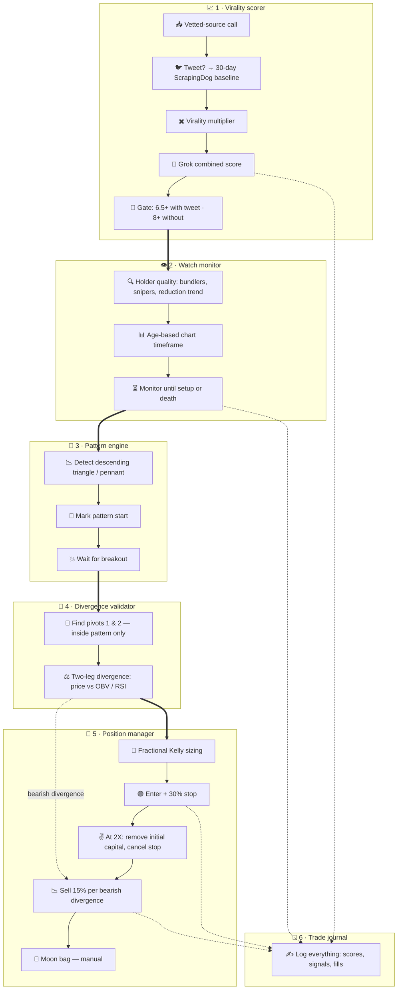

# Memecoin virality trader
Status: open
Updated: 2026-08-30
Emoji: 🪙

Two clean flows: one scores a called coin's virality to decide if it deserves attention, the other executes the trade and manages the exit ladder.

## This idea needs
1. Virality scoring gate
2. Watch monitoring
3. Pattern detection
4. Divergence validation
5. Position management
6. Full logging

## Departments

### Virality scorer
Readiness: now
Icon: 📈
One pipeline that takes a call from "someone called it" to "qualified or dropped" — intake and scoring share the coin's lifecycle, so they stay together.
Owns: vetted-source calls, tweet check, ScrapingDog 30-day baseline, virality multiplier, Grok combined score, 6.5/8 threshold gate
Needs from: nothing
Steps:
1. Listen for calls from vetted sources (a vetted source = a caller or group Bobby has pre-approved)
2. Check if the call has a tweet attached
3. If there is a tweet: pull a 30-day baseline via ScrapingDog (a web-scraping API) and compute the virality multiplier — how far engagement is running above its own normal
4. Send coin data plus the multiplier to Grok (xAI's model, used here as the scoring brain) for a combined score
5. Gate: 6.5+ with a tweet, 8+ without → promote to watch; otherwise drop the coin

### Watch monitor
Readiness: after-contract
Icon: 👁️
Owns the surveillance phase: is this coin's holder base healthy enough to keep watching?
Owns: holder quality (bundlers, snipers, reduction trend), age-based chart timeframe, monitor until setup or death
Needs from: Virality scorer
Steps:
1. Pin the contract with Virality scorer: the qualified-coin payload (coin ID, score, tweet data)
2. Check holder quality: bundlers (wallets that bought in the same block as launch), snipers (bots that buy in the first seconds), and the reduction trend (are early wallets selling off?)
3. Open the chart on the age-based timeframe (candle size matched to how old the coin is)
4. Keep monitoring: hand the coin on when a setup starts forming, or drop it if it dies

### Pattern engine
Readiness: after-contract
Icon: 📐
Pure chart-geometry team: finds the setup and fires the breakout event. Nothing else draws on charts.
Owns: descending triangle / pennant detection, pattern start marking, breakout wait
Needs from: Watch monitor
Steps:
1. Pin the contract with Watch monitor: the watch-list feed (live coins plus chart data)
2. Detect a descending triangle or a pennant (both = price squeezing into a tighter range before a move)
3. Mark the pattern start — all later divergence checks only look inside this window
4. Wait for the breakout (price leaving the pattern) and emit a breakout event

### Divergence validator
Readiness: after-contract
Icon: 🔀
The only department that compares price against oscillators — both for the entry check and for exit warnings while holding.
Owns: two-leg divergence check, pivot 1 & 2 detection, price vs OBV/RSI comparison, recurring bearish-divergence flags
Needs from: Pattern engine
Steps:
1. Pin the contract with Pattern engine: pattern window plus breakout event
2. On breakout, look only inside the pattern for a two-leg divergence: find pivot 1 and pivot 2 (swing points)
3. Compare price vs OBV (on-balance volume = running total of volume direction) or RSI (relative strength index = momentum gauge) across the two pivots
4. Valid divergence → emit an entry signal; invalid → pass on the coin
5. While a position is open, keep flagging qualifying bearish divergences (price makes a higher high, the oscillator doesn't) as exit signals

### Position manager
Readiness: waiting
Icon: 💼
Owns the whole position lifecycle from sizing to the moon bag — entry, stop, and scale-outs share state and a transaction boundary, so they are one team.
Owns: fractional Kelly sizing, entry, 30% stop, 2X capital recovery, 15% divergence scale-outs, moon bag handoff
Needs from: Divergence validator
Steps:
1. Pin the contract with Divergence validator: entry-signal and exit-signal shapes
2. Size the entry with fractional Kelly (Kelly = a formula for optimal bet size from win rate and odds; fractional = deliberately use only a slice of it, safer)
3. Enter and set a 30% stop (auto-sell if price falls 30% below entry, capping the loss)
4. At 2X: sell enough to recover the initial capital and cancel the stop — from here it's house money
5. On each qualifying bearish divergence: sell about 15% of what's left; repeat until only the moon bag remains
6. Moon bag is manual — hand it off to Bobby and close out the managed position

### Trade journal
Readiness: after-contract
Icon: 📓
Everything logged, one place: scores, gate decisions, watch events, signals, fills.
Owns: full event logging
Needs from: nothing — every department writes to it
Steps:
1. Pin the log schema contract (event types and fields) that every other department writes against
2. Record scores, gate decisions, watch events, entry/exit signals, and every fill
3. Make the log queryable per coin and per trade

## Parallel readiness
- Can start in parallel now: Virality scorer
- Can start in parallel after contract definition: Watch monitor, Pattern engine, Divergence validator, Trade journal
- Must perform joint design first: —
- Must wait for another department: Position manager (waits on Divergence validator)
- Blocked by external or owner dependency: —

## Structure tree
```
MEMECOIN TRADER
├── VIRALITY SCORER
│   ├── Intake (section)
│   │   └── vetted-source listener (feature)
│   ├── Scoring (section)
│   │   ├── tweet baseline engine (module)
│   │   │   ├── ScrapingDog 30-day baseline (feature)
│   │   │   └── virality multiplier (feature)
│   │   └── Grok combined score (feature)
│   └── Gate (section)
│       └── 6.5 / 8 threshold rule (feature)
├── WATCH MONITOR
│   ├── Holder quality (section)
│   │   └── holder analyzer (module)
│   │       ├── bundler detection (feature)
│   │       ├── sniper detection (feature)
│   │       └── reduction trend (feature)
│   └── Surveillance (section)
│       ├── age-based chart timeframe (feature)
│       └── setup-or-death loop (feature)
├── PATTERN ENGINE
│   └── Chart patterns (section)
│       ├── pattern detector (module)
│       │   ├── descending triangle (feature)
│       │   └── pennant (feature)
│       ├── pattern start marker (feature)
│       └── breakout watcher (feature)
├── DIVERGENCE VALIDATOR
│   └── Two-leg divergence (section)
│       ├── pivot finder (feature)
│       ├── price vs OBV/RSI comparator (feature)
│       └── bearish-divergence flagger (feature)
├── POSITION MANAGER
│   ├── Entry (section)
│   │   ├── fractional Kelly sizer (feature)
│   │   └── 30% stop (feature)
│   └── Exit ladder (section)
│       ├── 2X capital recovery (feature)
│       ├── 15% divergence scale-out (feature)
│       └── moon bag handoff (feature)
└── TRADE JOURNAL
    └── Event log (section)
        └── journal logger (module)
            └── per-coin / per-trade queries (feature)
```

## Unresolved
- Market & on-chain data provider — external dependency choice (Birdeye, Helius, Dexscreener…): supplies chart, OBV, and holder/bundler data; if it takes more than one API it may need its own Market data feed department — changes boundaries
- Vetted source list — owner-supplied input: which callers or groups count as vetted; shapes the intake adapter
- ScrapingDog + Grok API keys — owner-supplied input: scorer can't run without them
- Execution venue — external dependency choice: which exchange/DEX the Position manager trades on; possibly reuses the Trading bot idea's broker connection (issue #1)
- Moon bag size — owner-supplied input: how much remains when the 15% ladder stops
- Exit-divergence rules — contract question: do the same two-leg rules qualify a bearish divergence while holding, or a looser set?

## Unsorted
- —

## Raw log
- Okay. So, full workflow, end to end. Workflow one, research and qualification. Call out from a vetted source. If theres a tweet, run a thirty-day ScrapingDog baseline and compute virality multiplier. Send that to Grok for combined score. If it passes, andthose thresholds are six point five-plus with tweet, eight-plus without, then move into watch. During watch, check holder quality. Bundlers, snipers, reduction trend, and open the chart on the age-based time frame. Keep monitoring until a setup appears or the coin dies. Workflow two, execution. Detect descending triangle or pennant, mark pattern start, wait for breakout. After breakout, check only inside that pattern for a valid two-leg divergence, your first and second pivots, price versus OBV or RSI. If valid, size with fractional Kelly, enter, set 30% stop. At 2X, remove initial capital and remove the stop. Then on each qualifying bearish divergence, sell about 15% of the remaining. Repeat that until only the moon bag remains. Moon bag is manual. Everything logged. Two clean flows, one that decides if a coin deserves attention, and one that executes and manages. That separation ought to make the dev spec and your testing a lot easier and

## Consolidation report
Departments: 10 candidates → 6 final (call intake folded into Virality scorer — one pipeline; Kelly sizing and scale-outs stay inside Position manager on shared-lifecycle grounds; tweet team and holder-quality team absorbed into scorer and watch monitor)
Modules: 4 candidates → 4 genuine (tweet baseline engine, holder analyzer, pattern detector, journal logger)

## Diagram

