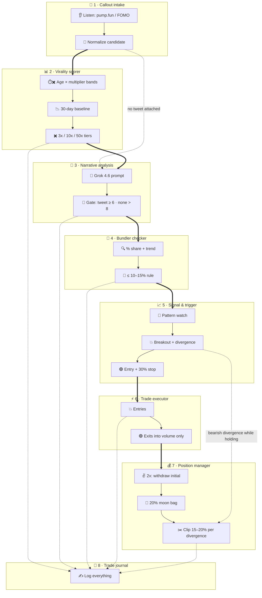

# Memecoin virality trader
Status: open
Updated: 2026-08-30
Emoji: 🪙
System: greenfield
Recommended: 8 departments, 10 sections, 7 genuine modules

Watches callouts from tracked traders/devs on pump.fun and FOMO, and when a called coin passes four gates — a tweet viral enough for its age band, a high Grok score, clean bundlers, and a chart breakout with divergence — it enters with a 30% stop-loss, then exits by a fixed ladder. Trigger: a callout arrives. Outcome: a closed, logged trade with the initial capital secured at 2x and a manual-only moon bag left running.

## Operating flow

```mermaid
flowchart TD
  A["📣 Callout arrives — tracked trader/dev calls a coin<br>on pump.fun or FOMO (web + mobile)"] --> T{"🐦 Tweet attached<br>to the coin?"}
  T -- "❌ No tweet" --> E["🧠 Grok 4.6 analysis (pre-generated prompt):<br>narrative, thesis, sentiment, virality score,<br>attention score via X search"]
  T -- "✅ Yes" --> C["📊 Build 30-day baseline:<br>capture every tweet, average likes + retweets"]
  C --> D{"⏱️✖️ Tweet age × multiplier<br>in its band?"}
  D -- "❌ Fails its band" --> R1["🚫 Reject — log reason"]
  D -- "✅ <1h ≥ 3x · 1–6h ≥ 10x · ≥24h ≥ 50x" --> E
  E --> F{"🧮 Combined score —<br>with tweet ≥ 6 · no tweet > 8?"}
  F -- "❌ Below" --> R3["🚫 Reject — log reason"]
  F -- "✅ Pass" --> G["🧬 Bundler check:<br>% share of supply + trend (down / flat / up)"]
  G --> H{"🚫 Bundlers<br>> 10–15%?"}
  H -- "❌ Too many" --> R4["🚫 Reject — log reason"]
  H -- "✅ Clean (lower better, 0% ideal)" --> I["📈 Watch the chart:<br>pennant or descending triangle forming"]
  I --> J{"💥 Breakout + OBV and/or RSI<br>divergence inside the pattern?"}
  J -- "⏳ Not yet" --> I
  J -- "✅ Trigger" --> K["🟢 Enter the trade —<br>set 30% stop-loss immediately"]
  K --> L{"📈 Price reaches<br>2x?"}
  L -- "⏳" --> L
  L -- "✅ 2x" --> M["💰 Withdraw initial capital"]
  M --> N["🌙 20% of remaining profit → moon bag<br>(never auto-sold — manual only)"]
  N --> O{"🔀 OBV or RSI divergence<br>(ideally both)?"}
  O -- "⏳ No" --> O
  O -- "✅ Yes" --> P{"🟢 Buy pressure?<br>green candle + volume"}
  P -- "❌ Wait" --> P
  P -- "✅ Sell into volume" --> Q["✂️ Clip 15–20% of remaining 80%"]
  Q --> S{"Position flat<br>(moon bag aside)?"}
  S -- "❌" --> O
  S -- "✅" --> FIN["🧾 Log result — trade complete"]
```


## This idea needs
1. Callout intake (pump.fun / FOMO sources)
2. Virality scorer (30-day baseline + age-tiered multiplier gates)
3. Narrative analysis (Grok 4.6, combined score > 8)
4. Bundler checker (strict ≤10–15% rule)
5. Signal & trigger (pattern + divergence + 30% stop)
6. Trade executor (Solana, sell-into-volume)
7. Position manager (2x rule, moon bag, clip ladder)
8. Trade journal (every gate + fill logged)

## Departments

### Callout intake
Readiness: ready-mocks
Icon: 📣
Responsibility: Detect and normalize every callout from the tracked traders/devs into one candidate shape the pipeline can score.
Starts when: the tracked-source list is configured (owner-supplied)
Completes when: a normalized candidate (coin address, attached tweet, callout timestamp, source) streams in real time
Boundary: owns source adapters and normalization; does not own scoring or trading
Owns: callout tracking, pump.fun / FOMO sources, web + mobile ingestion
Inputs: tracked-source list (owner), callout streams (external)
Outputs: normalized candidate → Virality scorer
Needs from: nothing
Steps:
1. Configure the tracked traders/devs list (which callers count — owner input)
2. Listen on pump.fun and FOMO channels (web + mobile sources)
3. Normalize each callout: coin address, attached tweet, timestamp, source
4. Emit the candidate to the Virality scorer

### Virality scorer
Readiness: ready-mocks
Icon: 📊
Responsibility: Decide whether the callout's tweet is hot enough *for its age* versus its own history — the tweet/coin qualification gate.
Starts when: a normalized candidate with a tweet attached arrives (no-tweet candidates skip straight to Narrative analysis)
Completes when: candidates are passed (multiplier meets its age band) or rejected with a logged reason
Boundary: owns the 30-day baseline, the multiplier math, and the age-band tiers; does not own narrative judgment or chart work
Owns: 30-day baseline, virality multiplier, age-band tiers (<1h ≥ 3x · 1–6h ≥ 10x · ≥24h ≥ 50x), customizable thresholds
Inputs: normalized candidate (Callout intake), tweet metrics (X API — external)
Outputs: qualified candidate + multiplier → Narrative analysis
Needs from: Callout intake
Steps:
1. Capture every tweet from the last 30 days, average likes + retweets into a baseline
2. Compare the coin's tweet against the baseline → multiplier (1x, 2x, 3x…)
3. Gate by tweet age: under 1 hour needs ≥ 3x; 1–6 hours needs ≥ 10x; 24 hours or more only passes at ≥ 50x (thresholds customizable in config)
4. These three tiers are the complete rule — anything outside them (including the 6–24h window) is not considered: reject and log
5. No-tweet candidates are not scored here — they go straight to Narrative analysis

### Narrative analysis
Readiness: ready-mocks
Icon: 🧠
Responsibility: Judge what the coin *is* and whether the attention is real — the AI scoring gate.
Starts when: a qualified candidate arrives (tweet band passed, or no tweet at all)
Completes when: a combined score is attached — pass at ≥ 6 with a tweet, > 8 without — or the coin is rejected with a logged reason
Boundary: owns the Grok prompt, the five extracted scores, and the dual threshold; does not own raw tweet collection
Owns: pre-generated prompt, narrative, thesis, sentiment, virality score, attention score, combined score, dual gate (≥ 6 with tweet · > 8 without)
Inputs: qualified candidate (Virality scorer) or no-tweet candidate (Callout intake), Grok 4.6 API (external, owner account)
Outputs: scored candidate → Bundler checker
Needs from: Virality scorer
Steps:
1. Feed candidate data into Grok 4.6 (grok-4.6 on the xAI API) with the pre-generated prompt
2. Extract: narrative, thesis, sentiment, virality score (tweet vs baseline), attention score (X search across Twitter)
3. Combine into one score
4. Gate 3 — dual threshold: with a tweet the combined score must be ≥ 6; without a tweet it must be > 8 (a tweet's virality earns the coin slack on the score)

### Bundler checker
Readiness: ready-mocks
Icon: 🧬
Responsibility: Verify the coin's holder base isn't rigged — the strict bundler gate.
Starts when: a >8 candidate arrives
Completes when: bundler % + trend are attached; coins over the limit are rejected with a logged reason
Boundary: owns bundler data and the trend call; does not own chart or narrative work
Owns: bundler % share, trend direction (down / flat / up), ≤10–15% strict rule
Inputs: scored candidate (Narrative analysis), bundler data (chain analytics — external)
Outputs: clean candidate → Signal & trigger
Needs from: Narrative analysis
Steps:
1. Pull the bundler share: wallets that bought in the creation block and their supply %
2. Read the full block and exclude program-owned accounts (the bonding curve) — tools disagree on this number, so the counting method is pinned here
3. Classify the trend: decreasing, stagnating, or increasing (0% ideal)
4. Gate 4 — strict: reject anything over 10–15% bundlers (below 10% preferred), especially if increasing

### Signal & trigger
Readiness: contract
Icon: 📈
Responsibility: Watch clean candidates' charts and fire the entry only when pattern and divergence agree. One team, because the divergence check only counts inside the pattern window — shared state.
Starts when: the qualified-candidate contract is frozen
Completes when: a validated entry signal fires (pattern + breakout + divergence) or the coin dies unwatched
Boundary: owns chart geometry and oscillators; does not own order execution
Owns: pennant / descending-triangle detection, breakout watch, OBV divergence, RSI divergence, entry trigger, immediate 30% stop rule
Inputs: clean candidate (Bundler checker), chart data OHLC + OBV/RSI (chart provider — external)
Outputs: trade intent (entry + 30% stop) → Trade executor; bearish divergences while holding → Position manager
Needs from: Bundler checker
Steps:
1. Pin the contract with Bundler checker: clean-candidate payload
2. Detect a pennant or descending triangle (price squeezing into a tighter range); prefer descending triangle
3. Mark the pattern start — divergence checks only count inside this window, never far back
4. Wait for the breakout; on breakout, confirm OBV divergence, RSI divergence, or both inside the pattern
5. Fire the entry signal with an immediate 30% stop-loss attached

### Trade executor
Readiness: waiting-owner
Icon: ⚡
Responsibility: The only department that moves money — enters and exits on Solana, and only ever sells into buy pressure.
Starts when: Bobby supplies the Solana wallet + keys (owner dependency) and the trade-intent contract is frozen
Completes when: entries and exits fill correctly on devnet, including the sell-into-volume rule
Boundary: owns transaction construction and fills; does not own when or why to trade
Owns: entries, exits, sell-into-volume filter (green candle + volume only), fill reporting
Inputs: trade intent (Signal & trigger), clip orders (Position manager), wallet keys (owner)
Outputs: fills → Position manager, Trade journal
Needs from: Signal & trigger
Steps:
1. Receive the Solana wallet + keys from Bobby (referenced by secret name, never stored raw)
2. Execute the entry when a trade intent arrives
3. Execute exits only into buy pressure: green candles and real volume, never into red
4. Report every fill with price, size, and timestamp

### Position manager
Readiness: contract
Icon: 💰
Responsibility: Run the fixed exit ladder from entry to flat — 2x rule, moon bag, and the clip strategy. One team because the ladder shares position state across every step.
Starts when: the first fill arrives from the Trade executor
Completes when: the position (moon bag aside) is flat and the result is logged
Boundary: owns the ladder and its state; does not own signal detection or transaction building
Owns: 2x initial-capital recovery, 20% moon bag rule, 15–20% divergence clips, position state
Inputs: fills (Trade executor), bearish divergences (Signal & trigger), live price + volume (chart provider — shared foundation)
Outputs: clip orders → Trade executor; results → Trade journal; moon bag → Bobby (manual)
Needs from: Trade executor
Steps:
1. Pin the contract with Trade executor: fill events and clip-order shape
2. At 2x: withdraw the initial capital — from here it is house money
3. Set aside 20% of the remaining profit as the moon bag (never auto-sold; manual at Bobby's discretion)
4. On each OBV/RSI divergence (ideally both): order a clip of 15–20% of the remaining 80%, routed through the executor's sell-into-volume filter
5. Repeat until flat; log the result and hand the moon bag to Bobby

### Trade journal
Readiness: ready-mocks
Icon: 📓
Responsibility: One queryable record of everything — every gate decision, score, watch event, signal, and fill.
Starts when: the log schema contract is pinned
Completes when: any coin or trade can be replayed end to end from the log
Boundary: owns the log schema and storage; does not own the events themselves
Owns: gate decisions, scores, watch events, signals, fills, per-coin and per-trade queries
Inputs: events from every department (shared foundation)
Outputs: replayable history → Bobby, debugging, future backtesting
Needs from: nothing — every department writes to it
Steps:
1. Pin the log schema contract (event types and fields) that every department writes against
2. Record scores, gate accept/reject reasons, watch events, entry/exit signals, and every fill
3. Make the log queryable per coin and per trade

## Correlated parallel groups
- Group: Qualification gauntlet | Members: Callout intake + Virality scorer + Narrative analysis + Bundler checker | Snap: 4 | Mode: frozen-contract | Contract: candidate schema + gate order + pass/fail payload | Risk: four gates built with different assumptions about the candidate fields
- Group: Trigger & execution | Members: Signal & trigger + Trade executor | Snap: 4 | Mode: frozen-contract | Contract: TradeIntent (entry + 30% stop) + idempotency rule | Risk: slippage and timing on pump.fun entries — a stale trigger fires a bad fill
- Group: Exit management | Members: Trade executor + Position manager | Snap: 5 | Mode: frozen-contract | Contract: fill-event schema | Risk: a missed fill corrupts the ladder state (moon bag vs clip split goes wrong)

## Dependency matrix
- Bobby → Callout intake | Supplies: tracked-source list (which traders/devs) | Type: owner | Blocking: yes | Mockable: yes
- Bobby → Trade executor | Supplies: Solana wallet + keys (secret reference) | Type: owner | Blocking: yes | Mockable: yes
- Bobby → Narrative analysis | Supplies: xAI API account (grok-4.6) | Type: owner | Blocking: yes | Mockable: yes
- Bobby → Virality scorer | Supplies: X API access + multiplier tier values (3x / 10x / 50x) | Type: owner | Blocking: yes | Mockable: no
- pump.fun / FOMO → Callout intake | Supplies: callout stream | Type: external | Blocking: yes | Mockable: yes
- X API → Virality scorer | Supplies: 30-day tweet metrics | Type: external | Blocking: yes | Mockable: yes
- xAI API → Narrative analysis | Supplies: narrative + scores | Type: external | Blocking: yes | Mockable: yes
- Chain analytics → Bundler checker | Supplies: bundler % + trend | Type: external | Blocking: yes | Mockable: yes
- Chart provider → Signal & trigger | Supplies: OHLC + OBV/RSI | Type: external | Blocking: yes | Mockable: yes
- Chart provider → Position manager | Supplies: live price + volume + divergences | Type: shared-foundation | Blocking: yes | Mockable: yes
- Callout intake → Virality scorer | Supplies: normalized candidate | Type: soft-internal | Blocking: no | Mockable: yes
- Virality scorer → Narrative analysis | Supplies: qualified candidate (viable + ≥3x) | Type: soft-internal | Blocking: no | Mockable: yes
- Narrative analysis → Bundler checker | Supplies: scored candidate (>8) | Type: soft-internal | Blocking: no | Mockable: yes
- Bundler checker → Signal & trigger | Supplies: clean candidate | Type: soft-internal | Blocking: no | Mockable: yes
- Signal & trigger → Trade executor | Supplies: trade intent + 30% stop | Type: soft-internal | Blocking: no | Mockable: yes
- Trade executor → Position manager | Supplies: fills | Type: soft-internal | Blocking: no | Mockable: yes
- All departments → Trade journal | Supplies: events | Type: shared-foundation | Blocking: no | Mockable: yes

## Snap ranking
1. Trade executor → Position manager — Snap 5 — fills feed the ladder directly through one event schema — freeze the fill-event contract first
2. Signal & trigger → Trade executor — Snap 4 — one trade-intent object with the stop attached — pin TradeIntent + idempotency rule
3. Virality scorer → Narrative analysis — Snap 4 — candidate passes with its metrics attached — freeze the candidate schema
4. Callout intake → Virality scorer — Snap 3 — needs the normalized coin+tweet shape — define the normalizer output
5. Narrative analysis → Bundler checker — Snap 3 — pass-through plus the Grok scores — extend the candidate schema
6. Bundler checker → Signal & trigger — Snap 3 — clean candidate with bundler verdict attached — extend the candidate schema again
7. Chart provider → Signal & trigger + Position manager — Snap 3 — two consumers of one provider — pick the provider early; it is a shared foundation

## Parallel readiness
- Can start in parallel now: Callout intake, Virality scorer, Narrative analysis, Bundler checker, Trade journal (all with mocks)
- Can start in parallel after contract definition: Signal & trigger, Position manager
- Must perform joint design first: —
- Must wait for another department: —
- Blocked by external or owner dependency: Trade executor (waits on Bobby's Solana wallet + keys)

## Structure tree
```
MEMECOIN VIRALITY TRADER
├── CALLOUT INTAKE
│   └── Source adapters (section)
│       ├── callout listener (module: external-adapter)
│       └── candidate normalizer (feature)
├── VIRALITY SCORER
│   └── Baseline engine (section)
│       ├── 30-day baseline calculator (module: project-specific)
│       ├── age × multiplier band check (feature)
│       └── multiplier tiers (configuration value)
├── NARRATIVE ANALYSIS
│   └── Grok scoring (section)
│       ├── Grok adapter (module: external-adapter)
│       └── score combiner (feature)
├── BUNDLER CHECKER
│   └── Holder verification (section)
│       ├── bundler data adapter (module: external-adapter)
│       └── trend classifier (feature)
├── SIGNAL & TRIGGER
│   └── Setup watcher (section)
│       ├── chart setup detector (module: project-specific)
│       └── entry trigger + 30% stop (feature)
├── TRADE EXECUTOR
│   └── On-chain execution (section)
│       ├── Solana execution adapter (module: external-adapter)
│       └── sell-into-volume filter (feature)
├── POSITION MANAGER
│   └── Exit ladder (section)
│       ├── exit ladder state machine (module: project-specific)
│       ├── moon bag vault (feature)
│       └── divergence clipper (feature)
└── TRADE JOURNAL
    └── Event log (section)
        └── per-coin / per-trade queries (feature)
```

## Unresolved
- Bundler data provider choice — external dependency: tools disagree on the % (creation-tx only vs full block, bonding-curve handling); one provider + counting method must be pinned, it changes the Bundler checker contract
- X API access — owner-supplied: 30-day tweet pull + X-search attention score needs the right tier; cost/access decision
- Chart data provider — external dependency choice (Dexscreener, Birdeye, Helius…): supplies OHLC + OBV/RSI for both Signal & trigger and Position manager
- Tweet metric source — external choice: X API directly or a scraper (the earlier draft used ScrapingDog); pick one for the baseline engine
- Moon bag handling — owner input: where it lives and how Bobby sells it manually (dashboard, wallet, or nothing to build)

## Unsorted
- Remove the descending triangle from the signal — it needs a lot of testing, not in the main MVP until developed and tested for accuracy. Instead use chart price [#5] — arrived via GitHub, not yet sliced — run /ideaslicer to place it
- Fractional Kelly sizing — from the earlier draft of this idea, not in Bobby's new flow; keep as the sizing rule or drop it? Parked until he says

## Raw log
- Full workflow, end to end. Call out from a vetted source → tweet 30-day baseline + virality multiplier → Grok combined score (6.5+ with tweet, 8+ without) → watch: holder quality (bundlers, snipers, reduction trend), age-based chart → setup: descending triangle or pennant, pattern start, breakout → two-leg divergence inside pattern (pivots, price vs OBV/RSI) → entry, fractional Kelly, 30% stop → 2X recover initial, cancel stop → 15% sells per bearish divergence → moon bag manual
- Step 1: Get a callout — track callouts from a group of traders or devs, usually on pump.fun or FOMO, via web or mobile. Step 2: Check the coin and tweet metrics — likes and retweets over 30 days for an average baseline, compare against the coin's tweet, check the multiplier; threshold customizable, hypothetically minimum 3x. Multiplier rule: if the tweet is over 50x its normal baseline, whether the coin is traded 24 hours later makes no difference, we still… [cut off]
- Detailed bot logic: 1) Tweet/coin qualification — tweet within 1h of coin creation stays viable; minimum multiplier (3x over 30-day baseline) = potential runner. 2) Grok analysis — Grok 4.6 with pre-generated prompt: narrative, thesis, sentiment, veracity score, attention score via X search; combined score must be over 8. 3) Bundler verification — % share trending down/flat/up, 0% ideal; strict rule: nothing over 10-15% bundlers, ideally below 10%. 4) TA and trigger — pennant or descending triangle; breakout + OBV and/or RSI divergence inside the pattern; enter and set 30% stop-loss immediately. 5) Profit taking — at 2x withdraw initial capital; 20% of remaining profit as moon bag (manual only); clip the remaining 80% by selling 15-20% on each OBV/RSI divergence; only sell into volume (buy pressure, green candles).
- Corrections: it's virality, not veracity. Score gate is dual — with a tweet the combined score must be 6; with no tweet it must be over 8. Delay exception: 24 hours or more is only acceptable at 50x multiplier or more. Age bands: under 1 hour → multiplier 3x or more; 1 to 6 hours → multiplier at least 10x.
- Tiers restated as the complete rule: we look at tweets above their normal baseline combined with token creation time — under 1 hour: 3x above baseline; 1 to 6 hours: 10x above baseline; 24 hours plus: 50x above baseline. Anything outside these tiers (incl. 6–24h) is not considered.

## Consolidation report
Departments: 10 candidates → 8 final (pattern + divergence merged into Signal & trigger — divergence only counts inside the pattern window, shared state; Kelly sizing demoted to Unsorted, not in the authoritative flow)
Modules: 9 candidates → 7 genuine (threshold config, moon bag vault, trend classifier demoted to feature/config)

## Diagram

