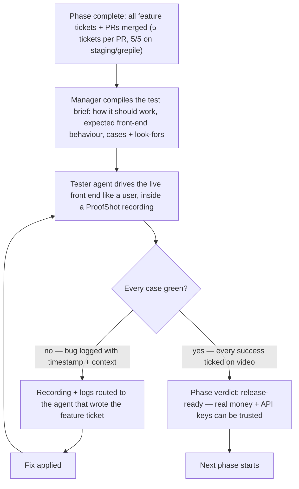
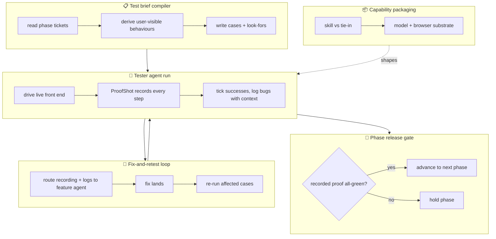

# Production user testing
Status: open
Updated: 2026-09-01
Emoji: 🧪
System: existing
Recommended: 5 departments, 2 sections, 2 genuine modules

A per-phase production gate: when a phase's feature tickets and PRs land, a tester agent drives the live front end exactly like a user — inside a ProofShot recording — against a test list the manager wrote, ticks what works, logs what breaks, and loops fixes back to the feature agent until recorded proof says the phase is release-ready. Applies to everything being built now or in the future, not just trading features.

## Existing system
- Already exists: manager + teammate team structure (herdr panes) · feature-ticket → PR pipeline (5 feature tickets per PR, staging/grepile pass bar) · ProofShot (GitHub repo — video + screenshot recording) · herdr in-app browser plugin · Idea Slicer / feature map pipeline (user-end verification maps already written per feature).
- Being extended: the phase workflow — a user-side testing gate is added between "phase complete" and "next phase starts".
- Being changed: the manager role — it now also compiles the test brief and routes failure evidence back to the feature-ticket agent.
- New: the tester agent run (live user-end driving + evidence logging), the test-case brief format, the fix-and-retest loop, the per-phase release verdict, and possibly a standalone skill packaging it all.

## Operating flow


## This idea needs
1. A tester agent that drives the real front end like a user — never Bobby.
2. A recordable, robust browser substrate (herdr in-app browser vs external Chrome).
3. ProofShot recording of every run.
4. A manager-written test brief per phase — specific cases, expected behaviour, look-fors.
5. Per-case success ticks and bug logs with timestamps and context.
6. A fix-and-retest loop routing evidence back to the feature-ticket agent.
7. A per-phase advance gate — testing never waits for project end.
8. A computer-use-strong driving model (GPT 5.6 cited as the benchmark leader).

## Departments

### Test brief compiler
Readiness: ready
Icon: 📋
Responsibility: turn a completed phase's feature tickets into the exact test brief the tester executes — for every case: how it should work, how the written code should behave in the front end, what to test, and what to look for.
Starts when: a phase closes (all feature tickets + PRs merged, 5/5 on staging/grepile).
Completes when: the tester agent holds a brief it can execute case by case with no ambiguity.
Boundary: owns test content; does not own executing tests or fixing code.
Owns: "the manager should give the tester a specific list of what needs to be tested", the three briefing points (how should it work · expected front-end behaviour · what to test and watch for), example cases (is the limit chaser working · higher/lower limits · cutting off, chasing, cancelling).
Inputs: the phase's feature tickets and merged PRs.
Outputs: the phase test brief → Tester agent run.
Needs from: nothing (reads the ticket pipeline's output).
Steps:
1. Collect the phase's feature tickets and PRs.
2. Derive the user-visible behaviours each ticket implies.
3. Write every case with its expected result and its look-fors.
4. Hand the brief to the tester agent run.

### Tester agent run
Readiness: joint-design
Icon: 🤖
Responsibility: execute the brief against the live product exactly like a user — click, enter, watch — and produce the run's evidence: a tick for every success, a bug entry with timestamp and context for every failure, all inside a ProofShot recording.
Starts when: the test brief arrives.
Completes when: every case in the brief has a recorded outcome (tick or bug).
Boundary: owns driving, observing, and recording; does not own the brief, the fixes, or the phase verdict.
Owns: "the bot must run these tests itself first", the user-side checks (order appearing in the order book and being filled · activity on the charts executing on the exchange · dynamic stop-losses moving, TPs hitting and closing, stop-losses triggering), success ticking (limit chaser fills at 0.06% → ticked), the recordable + error/bug/log/success tracking requirement.
Inputs: the test brief, access to the running product, the browser substrate.
Outputs: recorded run + results log → Fix-and-retest loop (failures) and Phase release gate (all-green).
Needs from: Test brief compiler (brief) · Capability packaging (substrate + model).
Steps:
1. Open the product in the browser substrate, ProofShot recording started.
2. Execute each brief case in order, exactly as a user would.
3. Tick each success with its expected value (e.g. fill at 0.06%).
4. Log each failure with timestamp, context, and what was expected vs seen.
5. Close the recording; emit the results log.

### Fix-and-retest loop
Readiness: ready-mocks
Icon: 🔁
Responsibility: turn every failure into a fixed, re-proven case — route the recording and logs to the agent that wrote the feature ticket, track the fix, and re-run the affected cases.
Starts when: a run logs one or more bugs.
Completes when: the affected cases re-run green on video.
Boundary: owns evidence routing and re-test scheduling; does not own applying the fix (the feature-ticket agent does).
Owns: workflow step 4 — "the manager passes the recording and logs back to the agent who wrote the feature ticket to apply a fix, followed by a re-test".
Inputs: failure logs + recordings; the feature agent's fix.
Outputs: re-test requests → Tester agent run; cleared cases → Phase release gate.
Needs from: Tester agent run (failures).
Steps:
1. Package each bug with its recording segment, log entries, and context.
2. Route the package to the agent that wrote the feature ticket.
3. Track the fix landing.
4. Re-run the affected cases only.

### Phase release gate
Readiness: waiting-internal
Icon: 🚦
Responsibility: decide, per phase, whether the product is genuinely release-ready — recorded front-end proof is the only accepted currency — and hold the next phase until that proof exists.
Starts when: a run reports all-green, or a phase claims completion.
Completes when: the phase verdict is issued — advance (proof recorded) or hold (cases open).
Boundary: owns the advance/hold decision; does not own testing or fixing.
Owns: "production-level testing to determine whether a feature is genuinely ready to release and whether real money and API keys can be trusted with it", "per phase rather than waiting until the entire project is finished, preventing building on a bloated codebase only to discover deep architectural flaws later".
Inputs: the recorded proof + results log.
Outputs: the phase verdict → the team pipeline (next phase starts or holds).
Needs from: Tester agent run (proof) · Fix-and-retest loop (cleared cases).
Steps:
1. Require the all-green recorded run for the phase.
2. Issue advance or hold.
3. On hold, point at the open cases blocking it.

### Capability packaging
Readiness: waiting-owner
Icon: 📦
Responsibility: make this capability available to every team, present and future — decide the form (a standalone skill or tied into the existing system), pick the driving model (computer-use strength), and lock the browser substrate (herdr in-app browser vs external Chrome).
Starts when: the idea is approved.
Completes when: any team can invoke production user testing with one instruction to their manager.
Boundary: owns the delivery vehicle and substrate; does not own briefs, runs, or verdicts.
Owns: "maybe we might need this to be a skill on its own, or just to tie it into the system", "applies to everything we are building now or in the future", the model notes (GPT 5.6 highest computer-use benchmark; solid with the in-app browser, unknown outside it), the herdr in-app browser plugin, "we can probably figure something out there, but it has to be robust".
Inputs: the proven testing flow from one team.
Outputs: the packaged capability (skill or system feature) → all teams.
Needs from: every other department (it packages the proven flow).
Steps:
1. Prove the flow on one team first.
2. Rule on standalone skill vs system tie-in.
3. Lock model + browser substrate against the robustness bar (recordable; tracks errors, bugs, logs, successes).
4. Roll out to all teams.

## Correlated parallel groups
- Group: Testing core | Members: Test brief compiler + Tester agent run + Fix-and-retest loop | Snap: 4 | Mode: frozen-contract | Contract: the test-brief format and the results-log format (case id · outcome · expected vs seen · timestamp · context · evidence link) | Risk: brief ambiguity — the tester can't execute, or ticks the wrong thing.
- Group: Substrate | Members: Capability packaging + Tester agent run | Snap: 3 | Mode: joint-design | Contract: browser substrate + driving model + ProofShot integration | Risk: picking a substrate that isn't recordable or can't reach the app reliably.

## Dependency matrix
- Test brief compiler → Tester agent run | Supplies: phase test brief | Type: hard-internal | Blocking: yes | Mockable: yes (sample brief)
- Tester agent run → Fix-and-retest loop | Supplies: failure logs + recording | Type: soft-internal | Blocking: no | Mockable: yes (sample logs)
- Tester agent run → Phase release gate | Supplies: recorded all-green proof | Type: hard-internal | Blocking: yes | Mockable: yes
- Fix-and-retest loop → Tester agent run | Supplies: re-test requests after fixes | Type: runtime | Blocking: no | Mockable: yes
- Phase release gate → team pipeline | Supplies: advance/hold verdict | Type: runtime | Blocking: yes | Mockable: no
- Feature-ticket pipeline → Test brief compiler | Supplies: completed phase tickets + PRs | Type: runtime | Blocking: yes | Mockable: yes
- ProofShot (GitHub repo) → Tester agent run | Supplies: video/screenshot recording harness | Type: external | Blocking: yes | Mockable: no
- herdr in-app browser → Tester agent run | Supplies: controllable browser surface | Type: external | Blocking: no (external Chrome is the fallback) | Mockable: no
- Bobby (model + form rulings) → Capability packaging | Supplies: driving-model choice, skill-vs-tie-in ruling | Type: owner | Blocking: yes | Mockable: no

## Snap ranking
1. Tester agent run → Phase release gate — Snap 5 — the recorded proof is exactly what the gate consumes — only the results-log format to freeze.
2. Tester agent run → Fix-and-retest loop — Snap 5 — recording + logs are the complete handoff package — shared evidence format.
3. Test brief compiler → Tester agent run — Snap 4 — the brief is a document the tester executes — brief format must be frozen so cases are unambiguous.
4. Capability packaging ↔ Tester agent run — Snap 3 — the substrate choice shapes the harness — one joint-design session.

## Parallel readiness
- Can start in parallel now: Test brief compiler (format draft + first brief), Capability packaging (substrate research)
- Can start in parallel after contract definition: Tester agent run (after brief + results-log formats frozen), Fix-and-retest loop (after evidence format)
- Must perform joint design first: Capability packaging + Tester agent run (substrate/model)
- Must wait for another department: Phase release gate (waits on Tester agent run)
- Blocked by external or owner dependency: Capability packaging (blocked by Bobby's model + form rulings)

## Structure tree
```
PRODUCTION USER TESTING
├── TEST BRIEF COMPILER
│   ├── Ticket intake (feature: reads the phase's tickets/PRs)
│   ├── Behaviour derivation (feature: user-visible behaviours from the code)
│   └── Brief writer (feature: cases + expected results + look-fors)
├── TESTER AGENT RUN
│   ├── User-end driving (section)
│   │   ├── Browser adapter (module: external-adapter — in-app browser or Chrome)
│   │   └── Case executor (feature)
│   └── Evidence capture (section)
│       ├── ProofShot recorder (module: external-adapter)
│       └── Results log (feature: ticks + bug entries with timestamps/context)
├── FIX-AND-RETEST LOOP
│   ├── Evidence router (feature: logs + recording → the feature-ticket agent)
│   └── Re-test scheduler (feature: re-run affected cases only)
├── PHASE RELEASE GATE
│   └── Verdict issuer (feature: advance/hold on recorded proof)
└── CAPABILITY PACKAGING
    ├── Form ruling (rule: standalone skill vs system tie-in)
    ├── Model selection (feature: computer-use benchmark check)
    └── Substrate lock-in (rule: in-app browser vs Chrome)
```

## Unresolved
- Standalone skill vs tied into the existing system — changes where the capability lives and how every team invokes it. (Bobby flagged: "maybe a skill on its own, or just tie it into the system".)
- Driving model — GPT 5.6 cited as the computer-use benchmark leader and solid with the in-app browser, but its strength outside that is unverified; the choice shapes the tester harness.
- Browser substrate — herdr in-app browser vs external Chrome; whichever is picked must stay recordable and robust (errors, bugs, logs, successes tracked).
- Dedicated testing agent vs the manager seat running tests itself — Bobby's workflow says "if using a dedicated testing agent", so team topology per project stays open.

## Unsorted
- —

## Facts
- Testing runs per phase, never deferred to project end: "We will conduct this testing per phase rather than waiting until the entire project is finished, preventing us from building on a bloated codebase only to discover deep architectural flaws later." [raw log]
- A phase enters testing when all its feature tickets and PRs are complete — 5 feature tickets per PR, passing refactoring, 5/5 on staging/grepile. [raw log]
- The agent manager triggers production-level user testing using ProofShot (the GitHub repository). [raw log]
- The bot runs these tests itself first, so the user demo is smooth, reliable, and bug risk is minimised. [raw log]
- On failure, the manager passes the recording and logs back to the agent that wrote the feature ticket; that agent fixes; a re-test follows. [raw log]
- Advance to the next phase only once recorded proof confirms everything works on the front end. [raw log]
- Before any testing, the manager hands the tester a specific test-case list: how it should work; how the written code should behave in the front end; what to test and what to look for. [raw log]
- Successes are ticked off explicitly — if the intention is the limit chaser fills at 0.06% and it does, that case is ticked. [raw log]
- This is production-level testing: it decides whether a feature is genuinely ready to release and whether real money and API keys can be trusted with it. [raw log]
- Scope is everything being built now or in the future; trading features (limit chaser, dynamic stop-loss with TP) are examples, not the scope. [raw log]
- The substrate must be recordable and must track errors, bugs, logs, and successes. [raw log]

## FAQs
- **Is this just for trading bots?** No. Limit chasers and dynamic stop-losses are the examples; the gate applies to every project, present and future.
- **Why not rely on backend tests?** Backend tests can all pass while the front end misbehaves. The only accepted proof is the feature working where the user sees it — the order in the order book, activity on the charts, stop-losses moving, TPs closing.
- **Who does the clicking?** The tester agent, never Bobby. Bobby watches the recording.
- **What makes a phase "done"?** Recorded video proof that every case in the manager's brief passed on the live front end. A reported "done" is not accepted.
- **Why per phase?** So deep architectural flaws surface before the next phase is built on top of them.

## Raw log
- Another thing we want to include across the teams is the ability to test user-side functionality as proof that things are working as they should. For example, if we build a limit chaser or a dynamic stop-loss with TP (take-profit), where hitting a TP moves the stop-loss up, we can run all the tests we want in the backend codebase. However, we ultimately need to verify it working on the front end: • The order appearing in the order book and being filled • Activity showing on the charts and executing on the exchange • Dynamic stop-losses moving, TPs hitting and closing, and stop-losses triggering properly The bot must run these tests itself first so that when the user demos it, the experience is smooth, reliable, and the risk of bugs is minimised. This is production-level testing to determine whether a feature is genuinely ready to release and whether real money and API keys can be trusted with it. While trading features like limit chasers and dynamic stop-losses are good examples, this applies to everything we are building now or in the future. We will conduct this testing per phase rather than waiting until the entire project is finished, preventing us from building on a bloated codebase only to discover deep architectural flaws later. The proposed workflow: 1. Complete all feature tickets and PRs for a given phase (with 5 feature tickets per PR, passing refactoring and hitting 5/5 on staging / grepile). 2. The agent manager triggers production-level user testing using ProofShot (the GitHub repository). 3. If using a dedicated testing agent, the manager instructs the agent on what to test, how to test it, and what to log and record (including specific details, timestamps, and context for any bugs or errors). 4. If issues are found, the manager passes the recording and logs back to the agent who wrote the feature ticket to apply a fix, followed by a re-test. 5. Once recorded proof confirms everything is working properly on the front end, we advance to the next phase. Maybe we might need this to be a skill on its own, or just to tie it into the system. Basically, the function would be to test something live from the user end, just like a user would test it, right? It would then record it and log what worked, along with any errors or bugs. This would be a model that is really good at computer-based usage (the highest benchmark, I believe, is GPT 5.6). It is quite solid with the in-app browser, though I am not sure how good it is outside of that. Herdr also has a plugin where we can have our own in-app browser inside the Herdr terminal. Having its own in-app browser instead of going outside to use something like Chrome might make the agent more powerful. We can probably figure something out there, but it has to be robust: • It must be recordable. • It needs to track errors, bugs, logs, and successes. If it does something right, we should know about it. For example, if the intention is to check whether the limit chaser fills at 0.06%, and it does, that gets ticked off. Before we even get into testing, the manager should give the tester a specific list of what needs to be tested: • Is the limit chaser working? • Are the higher and lower limits functioning properly? • Is it cutting off, chasing, or cancelling orders? That is just an example, but the point is that the manager provides the list of test cases and outlines the instructions for the green pass / feature ticket agent: 1. How should it work? 2. Based on what we have written code-wise, how should it behave in the front end? 3. What do we need to test, and what are we supposed to be looking out for?

## Consolidation report
Departments: 6 candidates → 5 final
Modules: 2 candidates → 2 genuine

## Diagram

