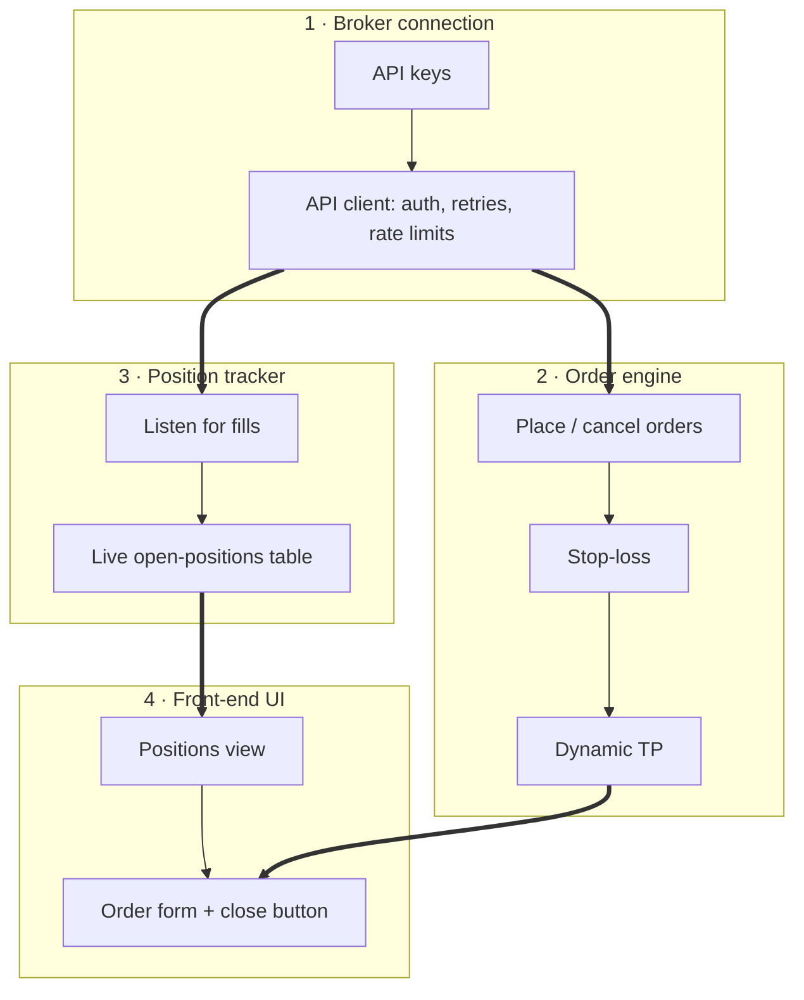

# Trading bot
Status: open
Updated: 2026-08-29
Emoji: 🤖

A bot that places orders with automatic loss-capping and profit-locking, watched from a dashboard.

## This idea needs
1. Broker connection (API keys + integration)
2. Order engine (placement, stop-loss, TP)
3. Position tracker
4. Front-end UI

## Departments

### Broker connection
Readiness: now
Everything talks to the exchange through this team.
Owns: API keys, API integration
Needs from: nothing
Steps:
1. Get API keys for the exchange (keys = the password that lets code trade on your account)
2. Wrap the exchange API in one client module — one place for auth, rate limits, retries
3. Prove it: fetch account balance and live price

### Order engine
Readiness: after-contract
The only department allowed to create, change, or cancel orders. Placement, stop-loss, and TP stay together because they share the order lifecycle.
Owns: Order placement, Stop-loss, Dynamic TP
Needs from: Broker connection
Steps:
1. Pin the contract with Broker connection: place/cancel calls, fill events
2. Place a basic market/limit order through the broker client
3. Attach a stop-loss (auto-sell if price drops to a level you set, capping the loss)
4. Attach a dynamic TP (take-profit: auto-sell to lock gains; "dynamic" = the level trails the price instead of sitting fixed)

### Position tracker
Readiness: after-contract
Single source of truth for what is open right now.
Owns: Tracking open positions
Needs from: Broker connection
Steps:
1. Pin the contract with Broker connection: fill-event stream shape
2. Subscribe to fill events from the broker client
3. Keep a live table of open positions: size, entry, current P&L
4. Reconcile with the exchange on startup and on a timer

### Front-end UI
Readiness: waiting
The dashboard; read-only views plus buttons that call the order engine.
Owns: Front end
Needs from: Order engine, Position tracker
Steps:
1. Show open positions live from the tracker
2. Order form with stop-loss + dynamic TP fields
3. Manual close button routed through the order engine

## Parallel readiness
- Can start in parallel now: Broker connection
- Can start in parallel after contract definition: Order engine, Position tracker
- Must perform joint design first: —
- Must wait for another department: Front-end UI (waits on Order engine + Position tracker)
- Blocked by external or owner dependency: —

## Structure tree
```
TRADING BOT
├── BROKER CONNECTION
│   └── API client (module)
│       ├── auth + API keys
│       └── rate limits + retries
├── ORDER ENGINE
│   ├── Placement (section)
│   │   └── order state machine (module)
│   └── Protective exits (section)
│       ├── stop-loss (feature)
│       └── dynamic TP (feature)
├── POSITION TRACKER
│   └── Live positions table (section)
│       └── P&L calculator (feature)
└── FRONT-END UI
    ├── Positions view (section)
    └── Order form (section)
```

## Unresolved
- Backtesting — could change department boundaries: its own Strategy department, or a mode of the order engine
- Alert channel — external dependency choice: Telegram, email, or push; affects who owns alerts
- Max position size value — owner-supplied input: the 2% figure needs Bobby's confirmation before it becomes a rule

## Unsorted
- alerts — ping me when a trade opens or closes (Telegram?) [#3] — arrived via GitHub, not yet sliced — run /idea-slicer to place it
- max position size — never risk more than 2% of the account on a single trade [#2] — arrived via GitHub, not yet sliced — run /idea-slicer to place it
- backtesting?? — could be its own Strategy department, or a mode of the order engine. Needs one more thought to decide.

## Raw log
- Stop-loss
- Dynamic TP
- Front end
- Tracking open positions
- API keys
- API integration
- Order placement functionality
- backtesting??
- max position size — never risk more than 2% of the account on a single trade [#2]
- alerts — ping me when a trade opens or closes (Telegram?) [#3]

## Consolidation report
Departments: 6 candidates → 4 final (stop-loss and TP teams merged into Order engine on shared-lifecycle grounds)
Modules: 4 candidates → 2 genuine (API client, order state machine)

## Diagram

