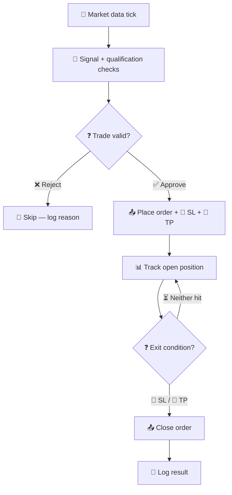
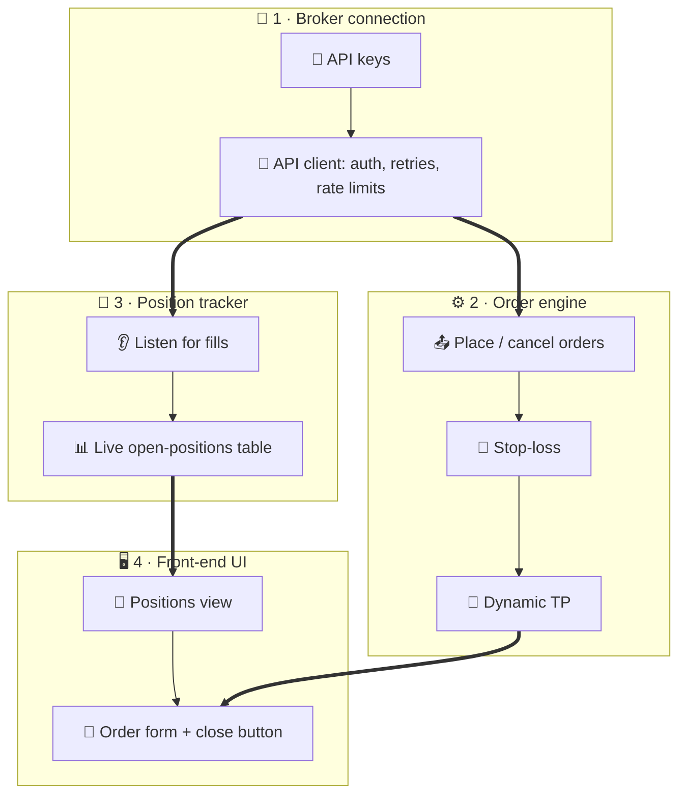

# Trading bot
Status: open
Updated: 2026-08-30
Emoji: 🤖
System: greenfield
Recommended: 4 departments, 6 sections, 2 genuine modules

A bot that watches the market, and when a valid signal appears, places an order protected by a stop-loss and a dynamic take-profit, then tracks the position until exit. Started by a market data tick; ends with a closed, logged trade.

## Operating flow


## This idea needs
1. Broker connection (API keys + integration)
2. Order engine (placement, stop-loss, TP)
3. Position tracker
4. Front-end UI

## Departments

### Broker connection
Readiness: ready
Icon: 🏦
Responsibility: Everything talks to the exchange through this team — the only department that touches the broker API.
Starts when: API keys for the exchange exist (owner-supplied)
Completes when: the client module returns account balance and live price from the exchange
Boundary: owns transport, auth, rate limits; does not own trading decisions or display
Owns: API keys, API integration
Inputs: API keys (owner), exchange API docs (external)
Outputs: broker client + fill events → Order engine, Position tracker
Needs from: nothing
Steps:
1. Get API keys for the exchange (keys = the password that lets code trade on your account)
2. Wrap the exchange API in one client module — one place for auth, rate limits, retries
3. Prove it: fetch account balance and live price

### Order engine
Readiness: contract
Icon: ⚙️
Responsibility: The only department allowed to create, change, or cancel orders. Placement, stop-loss, and TP stay together because they share the order lifecycle.
Starts when: the broker client contract is frozen (place/cancel calls, fill-event shapes)
Completes when: an order with attached SL + dynamic TP round-trips on the exchange test environment
Boundary: owns the order lifecycle and pre-trade qualification; does not own market data, position accounting, or display
Owns: Order placement, Stop-loss, Dynamic TP
Inputs: broker client (Broker connection), trade intent
Outputs: order events → Position tracker; order commands → Front-end UI
Needs from: Broker connection
Steps:
1. Pin the contract with Broker connection: place/cancel calls, fill events
2. Place a basic market/limit order through the broker client
3. Attach a stop-loss (auto-sell if price drops to a level you set, capping the loss)
4. Attach a dynamic TP (take-profit: auto-sell to lock gains; "dynamic" = the level trails the price instead of sitting fixed)

### Position tracker
Readiness: contract
Icon: 📡
Responsibility: Single source of truth for what is open right now.
Starts when: the fill-event contract is frozen
Completes when: a live positions table stays correct through fills, reconnects, and restarts
Boundary: owns position state and P&L math; does not own order decisions or display
Owns: Tracking open positions
Inputs: fill events (Broker connection), order events (Order engine)
Outputs: positions read model → Front-end UI
Needs from: Broker connection
Steps:
1. Pin the contract with Broker connection: fill-event stream shape
2. Subscribe to fill events from the broker client
3. Keep a live table of open positions: size, entry, current P&L
4. Reconcile with the exchange on startup and on a timer

### Front-end UI
Readiness: waiting-internal
Icon: 🖥️
Responsibility: The dashboard — read-only views plus buttons that call the order engine.
Starts when: the order engine and position tracker have real deliverables running
Completes when: Bobby can watch positions live and place/close an order from the screen
Boundary: owns display and user actions only; never talks to the exchange directly
Owns: Front end
Inputs: positions read model (Position tracker), order commands (Order engine)
Outputs: screen → Bobby
Needs from: Order engine, Position tracker
Steps:
1. Show open positions live from the tracker
2. Order form with stop-loss + dynamic TP fields
3. Manual close button routed through the order engine

## Correlated parallel groups
- Group: Broker plumbing | Members: Broker connection + Order engine | Snap: 4 | Mode: frozen-contract | Contract: broker client interface (place/cancel/fills) | Risk: auth and rate-limit assumptions drifting apart
- Group: Runtime truth | Members: Order engine + Position tracker | Snap: 5 | Mode: frozen-contract | Contract: order/fill event schema | Risk: missed fills on reconnect corrupting the positions table
- Group: Display | Members: Front-end UI + Position tracker + Order engine | Snap: 3 | Mode: integration-heavy | Contract: positions read model + command API | Risk: stale UI state; needs frequent checkpoints

## Dependency matrix
- Bobby → Broker connection | Supplies: exchange API keys | Type: owner | Blocking: yes | Mockable: yes
- Exchange API → Broker connection | Supplies: market data + order endpoints | Type: external | Blocking: yes | Mockable: yes
- Broker connection → Order engine | Supplies: broker client (place/cancel) | Type: hard-internal | Blocking: yes | Mockable: yes
- Broker connection → Position tracker | Supplies: fill-event stream | Type: soft-internal | Blocking: no | Mockable: yes
- Order engine → Position tracker | Supplies: order events | Type: soft-internal | Blocking: no | Mockable: yes
- Position tracker → Front-end UI | Supplies: positions read model | Type: soft-internal | Blocking: no | Mockable: yes
- Order engine → Front-end UI | Supplies: order command API | Type: soft-internal | Blocking: no | Mockable: yes

## Snap ranking
1. Order engine → Position tracker — Snap 5 — direct producer-consumer with one shared event schema — freeze the event contract, then both run in parallel
2. Broker connection → Order engine — Snap 4 — direct consumer of the client, needs a small adapter + fixtures — pin the client interface
3. Position tracker → Front-end UI — Snap 3 — needs a deliberately designed read model — define schema + mock server
4. Order engine → Front-end UI — Snap 3 — command path needs an idempotency rule — design the command contract before UI starts

## Parallel readiness
- Can start in parallel now: Broker connection
- Can start in parallel after contract definition: Order engine, Position tracker
- Must perform joint design first: —
- Must wait for another department: Front-end UI (waits on Order engine + Position tracker)
- Blocked by external or owner dependency: —

## Structure tree
```
TRADING BOT
├── BROKER CONNECTION
│   └── API client (module: external-adapter)
│       ├── auth + API keys (feature)
│       └── rate limits + retries (feature)
├── ORDER ENGINE
│   ├── Placement (section)
│   │   └── order state machine (module: project-specific)
│   └── Protective exits (section)
│       ├── stop-loss (feature)
│       └── dynamic TP (feature)
├── POSITION TRACKER
│   └── Live positions table (section)
│       └── P&L calculator (feature)
└── FRONT-END UI
    ├── Positions view (section)
    └── Order form (section)
```

## Unresolved
- Backtesting — could change department boundaries: its own Strategy department, or a mode of the order engine
- Alert channel — external dependency choice: Telegram, email, or push; affects who owns alerts
- Max position size value — owner-supplied input: the 2% figure needs Bobby's confirmation before it becomes a rule

## Unsorted
- alerts — ping me when a trade opens or closes (Telegram?) [#3] — arrived via GitHub, not yet sliced — run /ideaslicer to place it
- max position size — never risk more than 2% of the account on a single trade [#2] — arrived via GitHub, not yet sliced — run /ideaslicer to place it
- backtesting?? — could be its own Strategy department, or a mode of the order engine. Needs one more thought to decide.

## Raw log
- Stop-loss
- Dynamic TP
- Front end
- Tracking open positions
- API keys
- API integration
- Order placement functionality
- backtesting??
- max position size — never risk more than 2% of the account on a single trade [#2]
- alerts — ping me when a trade opens or closes (Telegram?) [#3]

## Consolidation report
Departments: 6 candidates → 4 final (stop-loss and TP teams merged into Order engine on shared-lifecycle grounds)
Modules: 4 candidates → 2 genuine (API client, order state machine)

## Diagram

