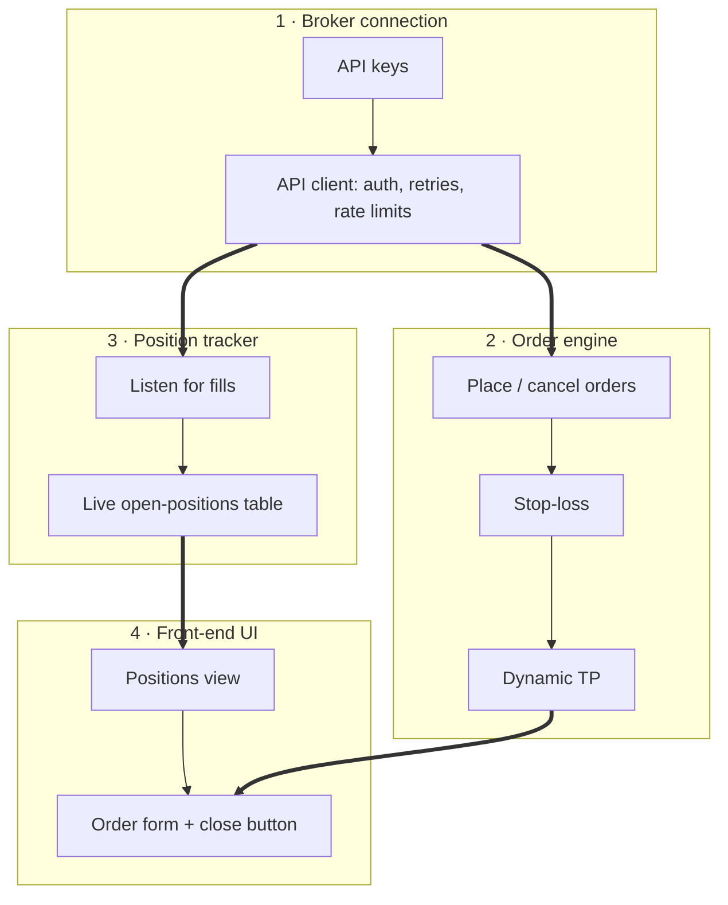

# Trading bot
Status: open
Updated: 2026-08-29
Emoji: 🤖

A bot that places orders with automatic loss-capping and profit-locking, watched from a dashboard.

## This idea needs
1. Broker connection (API keys + integration)
2. Order engine (placement, stop-loss, TP)
3. Position tracker
4. Front-end UI

## Raw log
- Stop-loss
- Dynamic TP
- Front end
- Tracking open positions
- API keys
- API integration
- Order placement functionality
- backtesting??

## Departments

### Broker connection
Everything talks to the exchange through this team.
Owns: API keys, API integration
Needs from: nothing
Steps:
1. Get API keys for the exchange (keys = the password that lets code trade on your account)
2. Wrap the exchange API in one client module — one place for auth, rate limits, retries
3. Prove it: fetch account balance and live price

### Order engine
The only department allowed to create, change, or cancel orders.
Owns: Order placement, Stop-loss, Dynamic TP
Needs from: Broker connection
Steps:
1. Place a basic market/limit order through the broker client
2. Attach a stop-loss (auto-sell if price drops to a level you set, capping the loss)
3. Attach a dynamic TP (take-profit: auto-sell to lock gains; "dynamic" = the level trails the price instead of sitting fixed)

### Position tracker
Single source of truth for what is open right now.
Owns: Tracking open positions
Needs from: Broker connection
Steps:
1. Subscribe to fill events from the broker client
2. Keep a live table of open positions: size, entry, current P&L
3. Reconcile with the exchange on startup and on a timer

### Front-end UI
The dashboard; read-only views plus buttons that call the order engine.
Owns: Front end
Needs from: Order engine, Position tracker
Steps:
1. Show open positions live from the tracker
2. Order form with stop-loss + dynamic TP fields
3. Manual close button routed through the order engine

## Unsorted
- backtesting?? — could be its own Strategy department, or a mode of the order engine. Needs one more thought to decide.

## Diagram

